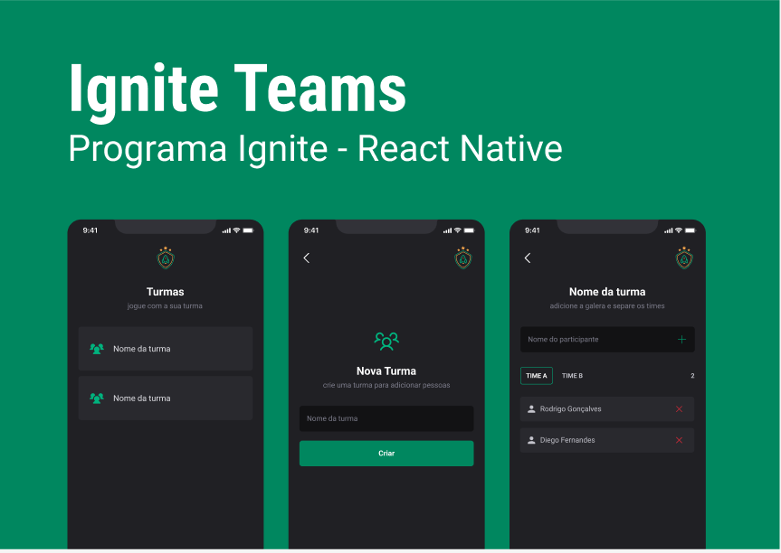
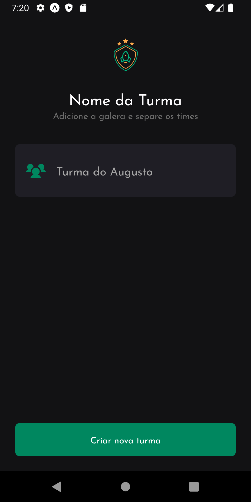
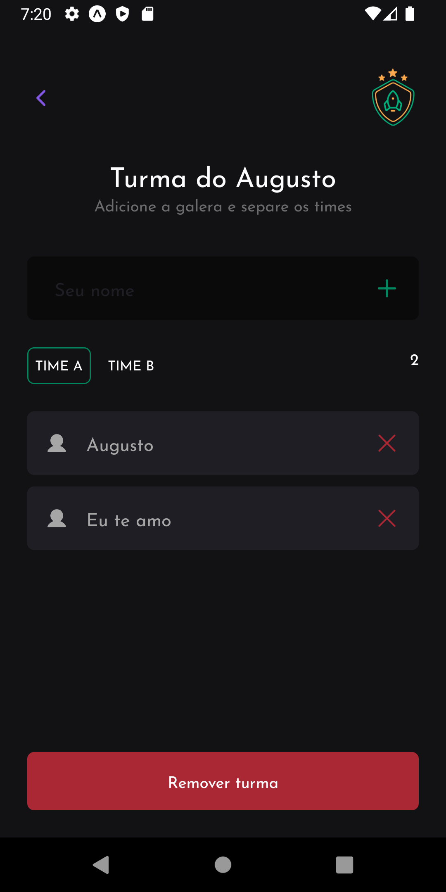
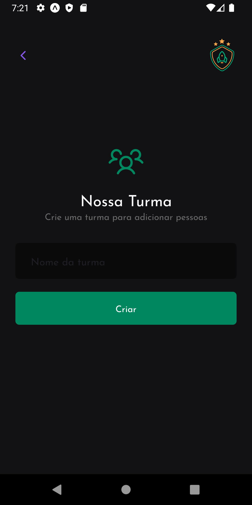

<h1  align="center">App React Native Ignite Team</h1>


<p align="center">
    
  <a href="https://opensource.org/licenses/MIT">
    
  </a>
</p>

<h1  align="center">Capa</h1>

<p align="center">  
   
</p>

<h1  align="center">Screenshots</h1>

|   Screenshot 1  |   Screenshot 2  |   Screenshot 3  |
|-----------------|-----------------|-----------------|
|  |   |  |

<h1  align="center">Como iniciar</h1>

```bash
  git clone https://github.com/augustojaml/ignite-2022-react-native-projeto-2.git
```

<h1  align="center">Instalar dependências</h1>

```bash
  yarn start
```

<h1  align="center">Executar app</h1>

```bash
  expo start
```

<h1  align="center">Sobre o Iginte Team</h1>

Tem o propsito de reunir pessoas para trabalhar ou jogar em turmas

<h1  align="center">Tecnologias</h1>

- [Laytout Figma]([Figma](https://www.figma.com/file/v2D7tt71DpCWPFsyAlJ2m9/augustojaml-ignite-team?node-id=37%3A6))
- [React Native](https://reactnative.dev/)
- [expo](https://docs.expo.dev/)
- [TypeScript](https://www.typescriptlang.org/)
- [Eslint](https://eslint.org/)
- [axios](https://github.com/axios/axios)
- [styled-component](https://styled-components.com/)
- [@react-native-async-storage/async-storage](https://www.npmjs.com/package/@react-native-async-storage/async-storage)
- [React Navigation](https://reactnavigation.org/)
- [react-native-svg-transformer](https://github.com/kristerkari/react-native-svg-transformer)

<h1  align="center">Licença</h1>
<a href="https://opensource.org/licenses/MIT">
    
</a>
<br>
Esse projeto está sob a licença MIT. Veja o arquivo [LICENSE](/LICENSE) para mais detalhes.

<h1  align="center">Augusto Monteiro | @augustojaml</h1>

Feito com carinho :purple_heart: by [Augusto Monteiro](https://github.com/augustojaml)

[](https://www.linkedin.com/in/augustojaml)
[](mailto:jamonteirolima@gmail.com)


